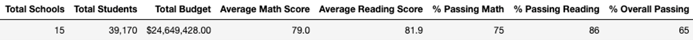

# School_District_Analysis

School board notified of evidence of academic dishonesty in reading and math grades for Thomas High School ninth graders with altered grades. Therefore, School Involved, uphold state-testing standards adjustments by replacement of the altered data leaving the rest intact. This was done by replacing compromised data with NaNs and run the whole analysis to see the effects it might hold within the school analysis. 

The following analysis  is the written report presenting the results of the technical analysis [PyCitySchoolsNaN](PyCitySchools_Challenge.ipynb)

## Overview of the analysis:
- A high-level snapshot of the district's key metrics, presented in a table format
- An overview of the key metrics for each school, presented in a table format
- Tables presenting each of the following metrics:
- Top 5 and bottom 5 performing schools, based on the overall passing rate
- The average math score received by students in each grade level at each school
- The average reading score received by students in each grade level at each school
- School performance based on the budget per student
- School performance based on the school size 
- School performance based on the type of school

### Objective
- Replace ninth-grade reading and math scores

- Repeat the school district analysis

- Analyse and report findings

### Methods:
Analysis of the school data were performed using Python 3.9.7, Pandas and Jupyter Notebook. 
School data was provided on CSV (comma separated files) and involved two files one with schools data [SchoolData](Resources\schools_complete.csv) and the second with the students data, [StudentsData](Resources\students_complete.csv). 

After setting up the proper dependencies and importing the data, the first step in the process was cleaning up the data removing prefixes and suffixes that could hindrance the information retrieval. 

The first part of the analysis after cleaning the data was to replace the compromised reading and math scores from Thomas High school ninth grade. After modifying the data for NaN in those entries so that they wouldn’t be taken into account, all the school analysis was done again. 

The analysis was then summarised in one data frame containing the different categorization. This where School Type, Total Students, Total School Budget, Per Student Budget, Average Math Score, Average Reading Score, % Passing Math, % Passing Reading, % Overall Passing

Lastly a deeper analysis of the data was performed by retrieving and ordering the information by different aspects. This where High and Low performing schools, Average scores per grade, Scores by school spending, scores by school size and scores by school type. 

# Results
Note: Refer to the whole analysis in the ipynb [PyCitySchoolsNaN](PyCitySchools_Challenge.ipynb) and [PyCitySchools](PyCitySchools.ipynb) to find details on each step. Here general punctual aspects will be compared and described. 

- School Summary
Regarding the difference between the general analysis between data that includes the altered grade group and the data without the altered scores, we could see that there was no significant difference between them in regards to Average Math and reading scores with a difference of 0.1 specifically in average math score. Average reading score remained the same. 
Regarding percentages between passing math and reading, difference between analysis were 0.2 in passing math percentage and and 0.3 in passing reading percentage. Overall passing percentages was 0.1 difference between them as seen in the images below. 

Images: Summary with altered grades in white, Summary without altered grades in black

- High/Low Performing schools

As seen in the following tables, regarding high and low performing schools, despite the overall percentage in Thomas high school had a difference of 3.1 between the two analysis Thomas high school still reached the top performing schools, even after removing the altered data and replace it with NaN. The change was no significative in the top five performance. 

Tables: Performance with altered grades in white, Performance without altered grades in black

To understand where the impact of the altered grades was, further analysis was performed. This where creating average scores per grade, Scores by school spending, scores by school size and scores by school type. 

- Average scores per grade
Regarding scores per grade only Thomas High School ninth grade was affected as the data are replaced with NaN, the rest of the grades remain the same thus showing no impact on the school performance. 

- Scores by school spending
After categorizing spending bins and calculating the averages we could conclude that no significant change was seen. The budget per student reported by Thomas Highschool was $638.00 , which was not altered after cleaning the altered grades and replacing them with NaN as seen in the table of spending summary with spending ranges per student. Rest remained the same too. Its interesting that the budget does not affect the performance of the schools. This is not a factor that affects grades of students. 

- Scores by school size
Thomas High school was considered a Medium sized school with students between 1000-2000, modifying the ninth grades entries into NaN didn’t had an impact or modify the arrangement of the school size for this school. Rest remained the same too. 

- Scores by school type
Lastly school type had no alteration wither with the NaN replacement of the data for the ninth graders of Thomas High School. As the only modification in the data was done to the ninth grade and the scores and not with any characteristic of the rest of the school information, like type, or the rest of the grades. 

## Summary: 

Differences between summaries with the 9th grade altered math and reading scores for Thomas High School were in average minimal (difference of 0.1), whereas percentage of passing showed a slightly higher difference between them (difference of 0.3) as shown in results. 
Regarding High and low performing schools, the faulty data of the ninth graders, made no significant change in performance relative to other schools. 

As only the ninth grade data was altered and taken out of the operations by replacing with NaN, it was seen how the parameters within the analysis were not affected by this. 
Budget, school type and size seem not to be relevant to the performance of schools in the end analysis, therefore further deeper analysis of other elements might proof to be ideal if the board as well as Maria are interested to find possible variables apart from those that could relate to a higher or lower performance. For instance, school plan, evaluations, or even professors skills or tools to benefit the students performance. 

It is however important to find out how a whole grade (ninth grade) were pushed to decide to cheat in the tests, and take needed measures to avoid this kind of incidents again. It might be a call for help or a lack of discipline that needs to be taken care of and taken into consideration.

